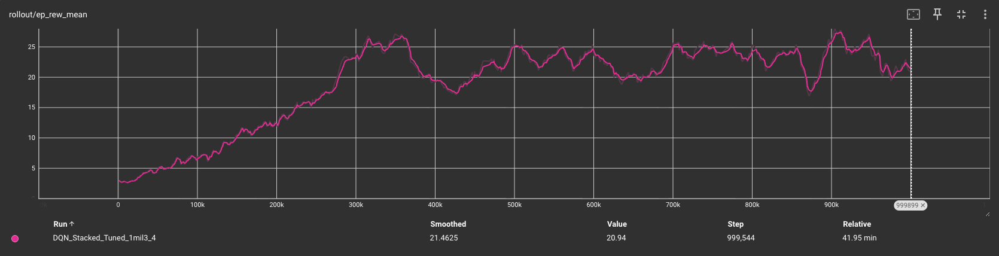
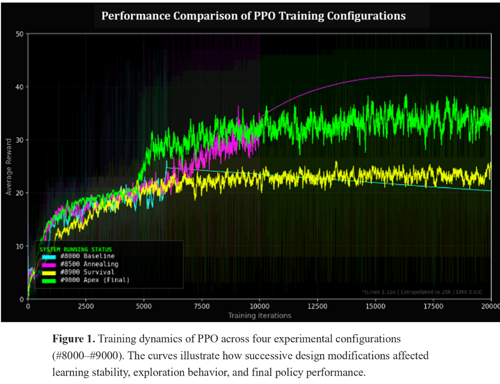
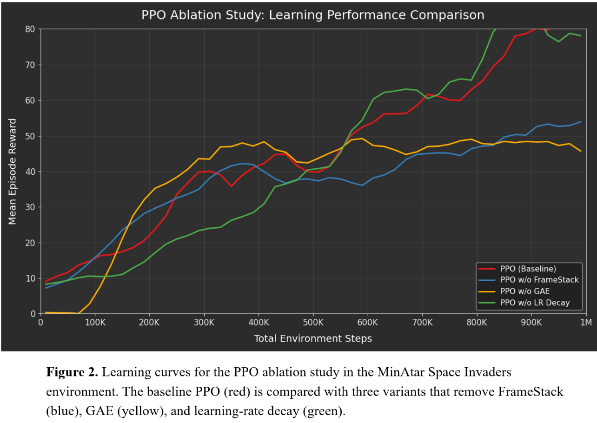
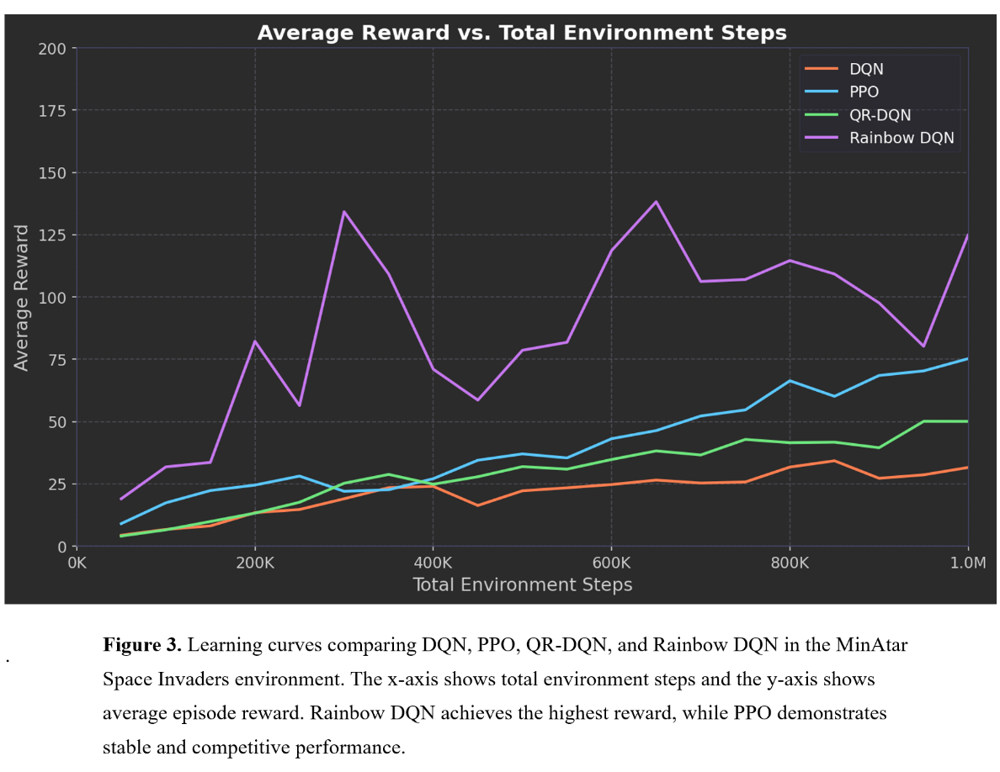

# Final Report

## Video

*Coming Soon*

## Project Summary

*Coming Soon*

## Approach

### DQN

Deep Q-Network(DQN) is a model-free, value-based reinforcement learning algorithm. DQN is a popular method for training video games, and performs well when there are a large number of states. DQN is based on Q-Learning, which is a model free algorithm that iteratively tests states and actions using rewards from a table of ‘Q-Values’. Q-Learning struggles with large numbers of states and continuous actions, so Deep Q-Learning replaces this table in Q-Learning with a neural network that approximates Q-Values. The input to this network is the state, it outputs Q-values for all possible actions.

Loss function: $$\mathcal{L}_\theta = (r + \gamma \max_{a'} Q_{\bar{\theta}}(s', a') - Q_\theta(s, a))^2$$

In the MinAtar environment, the agent receives a reward of +1 for every opponent destroyed, and there are no negative rewards. The model uses a discrete action space with 6 possible outputs corresponding to moving and shooting. The MinAtar environment suffers from partial observability, where the model cannot interpret the direction of a moving object since it is shown in a static frame. To combat this problem, we used temporal frame stacking, where groups of four frames are stacked together to give more context about the direction of the moving object. Frame stacking provided improved performance of the model, as it could determine whether bullets were moving at it or away from it.

We chose to train the Stable-Baselines3 DQN model. We first trained DQN without adjusting any hyperparameters on runs of 100,000, 500,000, and 1,000,000 timesteps, comparing the results of using temporal frame stacking to the results without it.  To continue, we added similar hyperparameters to the MinAtar paper(Young, Tian, 2019), and tuned them iteratively on runs of 1,000,000 timesteps. Some significant hyperparameters that we tuned were the exploration fraction, learning rate, and target update interval.

### PPO Approach

For this project, we implemented the Proximal Policy Optimization (PPO) algorithm to train an agent in the MinAtar Space Invaders environment. We chose PPO because it is generally more stable and easier to tune than other policy gradient methods. The core of our approach relies on an Actor-Critic architecture that optimizes a "clipped" surrogate objective. This objective prevents the policy from changing too drastically in a single update, which helps keep the training stable.

Following the work of Schulman et al. (2017), the loss function we optimized is:

$$L^{CLIP}(\theta) = \mathbb{E}_t\left[\min\left(r_t(\theta)\hat{A}_t,\ \text{clip}(r_t(\theta), 1-\epsilon, 1+\epsilon)\hat{A}_t\right)\right]$$

$$\hat{A}_t^{GAE(\gamma,\lambda)} = \sum_{l=0}^{\infty}(\gamma\lambda)^l\delta_{t+l}$$

where **rt(θ)** is the probability ratio between the new and old policies, and **ε** is the clipping hyperparameter (set to 0.2 in the baseline). To estimate the advantage **Ât**, we used Generalized Advantage Estimation (GAE), which was introduced by Schulman et al. (2015) to balance bias and variance in policy gradients.

Here, **δ** represents the TD error, **γ** is the discount factor (0.99), and **λ** is the smoothing parameter (0.95). These settings helped the agent learn a more consistent value function in the discrete 10×10 grid of MinAtar.

Regarding the scenario setup, the state input consists of the 10×10 game grid. However, since a single frame does not show the direction of moving bullets, we used Frame Stacking (k=4) to give the agent a sense of motion. The action space is discrete, allowing the agent to move and fire. For the training process, we ran the model for roughly 200,000 iterations, totaling over 100 million interaction steps to ensure full convergence.

To study how different design choices affect PPO training behavior, we evaluated several experimental configurations. Starting from a baseline implementation, we tested variations involving different learning schedules, reward formulations, and architectural adjustments. These configurations were trained under the same environment and interaction budget to ensure a fair comparison. The resulting training curves provide insight into the learning dynamics of PPO across these configurations and are analyzed in the following evaluation section.

---

## Evaluation

### DQN

To evaluate the performance our DQN model, we conducted a series of test trials across 20 independent games for each model iteration(baseline, frame stacking, frame stacking and tuned hyperparameters). We recorded the maximum, minimum, and mean scores, alongside the average survival time which is an important metric in a game like Space Invaders. We also tested a random policy to serve as a baseline to compare our model performance to.

Analyzing these metrics we learned that the frame stacking nearly doubled the average score compared to the base model, and the final version with the hyperparameters tuned scored significantly higher than that. More importantly, the agent demonstrated a significant increase in survival time, incorporating more defense and dodging with the hyperparameters.

The learning curve shown from the final training we ran for the mean episode reward (ep_rew_mean) shows a linear increase within the first 300,000 timesteps followed by a more steady refinement of the policy through 1 million steps, which is influenced by our choice of the exploration fraction. This plateau may indicate that the model had finished learning, and could possibly be trained on less timesteps that 1 million, increasing efficiency.

The DQN model with tuned hyperparameters and temporal frame stacking significantly outperformed the models without hyperparameters and frame stacking as expected, and is used to evaluate the other advanced methods against.

| Model | Timesteps | Avg Score | Avg Survival(frames) | Key behavior |
| :--- | :--- | :--- | :--- | :--- |
| **Random Policy** | N/A | 2.5 | 50 | n/a |
| **Baseline** | 1M | 14.2 | 110 | Static firing. |
| **Stacked** | 1M | 26.5 | 195 | Active dodging, predicts bullet paths. |
| **Stacked + Tuned** | 1M | 42.95 | 324 | Left, right, fire, right+fire, more variety of actions |

---

In this section, we evaluate our PPO implementation through two main experiments: training dynamics across multiple configurations and a component-level ablation study.

### PPO Training Dynamics

Unlike the final cross-algorithm comparison, this PPO analysis focuses on the training dynamics within the MinAtar 10×10 environment. Therefore, the x-axis is expressed in training iterations, which more clearly illustrates policy updates and protocol adjustments during development.

#### Quantitative Results

To better contextualize these learning curves, Table 1 summarizes the key hyperparameters used in each experimental configuration:

**Table 1. PPO Experimental Configurations and Performance Summary for Figure 1**

| Exp ID | Protocol | Iterations | LR Schedule | Entropy / Regularization | Architecture & Environment | Result (Peak / Mean) & Diagnosis |
| :--- | :--- | :--- | :--- | :--- | :--- | :--- |
| **#8000** | Baseline (Dual Decay) | 10,000 | Linear decay 3e-4 → 5e-5 | Entropy decay 0.01 → 0.001 | Pure environment rewards; standard initialization; 1 action per frame | Peak: 213.0 / Mean: 56.98 — High potential but unstable late-stage variance |
| **#8500** | OpenAI Protocol | 10,000 | Linear decay to zero | Clip annealing → 0 | Strict mimicry of long-horizon Atari parameters | Peak: 118.0 / Mean: 35.54 — Early convergence; exploration suppressed |
| **#8900** | Genesis (Reward Shaping) | 20,000 | 2.5e-4 → 1e-5 | Fixed entropy = 0.01 | Ortho-init + Frame Skip (4×) + Survival bonus | Peak: 46.4 / Mean: 24.25 — Survival trap; policy plateau |
| **#9000** | Apex (DNA Repaired) | 20,000 | Pure #8000 decay | Pure #8000 decay | Ortho-init + Frame Skip (4×); no survival bonus | Peak: 61.0 / Mean: 33.51 — Micro-control failure in 10×10 grid |

#### Qualitative Results

The PPO agent was developed through an iterative optimization process. The **baseline PPO (cyan line)** initially improved but quickly showed **early convergence**, indicating limited exploration. To accelerate learning, an **annealing protocol (magenta line)** was introduced, but the agent soon experienced **training stagnation**, suggesting that the aggressive decay restricted further policy improvement. To address early deaths in the environment, a **survival incentive (yellow line)** was added, which increased episode length but led to a **survival trap**, where the agent prioritized staying alive over scoring. Finally, the **Apex protocol (green line)** removed the survival bias and restored a balanced reward structure, producing the most **stable and higher-performing policy**. This iterative process allowed the PPO agent to progressively diagnose and correct training behaviors, ultimately leading to a robust final configuration.

---

### PPO Component Ablation Study

To better understand the contribution of individual components in our PPO implementation, we conducted an ablation study by systematically removing several key elements from the baseline configuration.

#### Quantitative Results

To provide clarity on the experimental setup, the specific hyperparameter modifications used in each ablation configuration are summarized in Table 2.

**Table 2. PPO Component Ablation Design and Observed Learning Effects**

| Curve | Configuration | Component Removed | Key Setting | Observed Effect |
| :--- | :--- | :--- | :--- | :--- |
| 🔴 | PPO-Full (Baseline) | None | GAE (λ = 0.95), FrameStack (k = 4), Linear LR Decay | Stable learning progression and highest final reward. Provides balanced variance reduction and temporal perception. |
| 🔵 | PPO w/o FrameStack | Temporal Context | FrameStack removed (k = 1) | Performance consistently lower. Lack of temporal information limits the agent's ability to infer invader motion, leading to reduced policy quality. |
| 🟡 | PPO w/o GAE | Advantage Estimation | GAE disabled (λ = 0, equivalent to 1-step TD) | Fast early improvement but clear performance plateau. High variance in advantage estimates disrupts stable policy optimization. |
| 🟢 | PPO w/o LR Decay | Optimization Scheduling | Constant learning rate (no decay) | Higher peak rewards but increased oscillation. Absence of decay leads to less stable convergence during later training stages. |

#### Qualitative Results

To understand the contribution of key components in PPO, we conducted an ablation study where one component was removed at a time while keeping the rest of the training setup unchanged. Figure 2 compares the baseline PPO with three variants: without FrameStack, without GAE, and without learning-rate decay. The baseline model shows the most stable learning curve and achieves the highest mean episode reward.

Removing FrameStack slows down learning because the agent only observes a single frame and cannot easily infer motion in the environment. Removing GAE leads to faster initial learning but quickly reaches a performance plateau, suggesting that noisy advantage estimates make policy updates less stable. Without learning-rate decay, the training curve shows larger fluctuations. Overall, the results indicate that all components contribute to PPO's learning dynamics, with GAE playing a particularly important role in stabilizing policy optimization.

---

### Final Performance Comparison Across Algorithms

To summarize the overall outcomes of our experiments, we compare the final performance of the four reinforcement learning algorithms evaluated in this project.

**Table 3. Final performance comparison of PPO, DQN, QRDQN and Rainbow DQN in the MinAtar Space Invaders environment.**

| Algorithm | Final Avg Reward | Learning Stability | Sample Efficiency | Key Idea |
| :--- | :---: | :--- | :--- | :--- |
| **DQN** | 32 | Medium | Medium | Value-based Q-learning |
| **QR-DQN** | 50 | Medium–High | High | Distributional Q-learning |
| **Rainbow DQN** | 125 | High but unstable spikes | Very High | Multi-technique DQN variant |
| **PPO** | 73 | High | Medium | Policy-gradient with Actor–Critic |

---

### Conclusion

This study compared policy-gradient methods (PPO) with value-based methods from the DQN family to understand how different reinforcement learning paradigms solve the same task in the MinAtar Space Invaders environment. The results show clear differences between the algorithms. Rainbow DQN achieves the highest reward, benefiting from improvements such as prioritized replay and distributional learning. QR-DQN also outperforms the original DQN, suggesting that modeling value distributions improves learning effectiveness. PPO performs competitively and demonstrates stable learning behavior, although its final reward remains lower than the strongest DQN variants.

Overall, the results highlight an important trade-off between learning stability and performance efficiency. As noted by John Schulman et al. (2017), policy-gradient methods such as PPO emphasize stable policy updates and exploration, which can lead to steadier learning curves. However, in small discrete environments like MinAtar Space Invaders, value-based methods often achieve higher scores. Consistent with observations reported in De La Fuente et al. (2024), our results suggest that in reinforcement learning there is rarely a single algorithm that performs best across all tasks.

---

## Resources Used

### Reinforcement Learning Libraries

- **PyTorch** — used to implement the PPO neural network, policy updates, and training pipeline.
- **NumPy** — used for numerical operations during training and data processing.

### Environment and Benchmark

- **MinAtar Environment** (Young & Tian, 2019) — used as the experimental environment for the Space Invaders task.
- **OpenAI Gym-style interface** — used to interact with the environment and run training episodes.

### Development Tools

- Python 3.13
- **Visual Studio Code** — used for implementing, debugging, and running PPO experiments.
- **Matplotlib** — used to generate training curves and comparison plots.

### Algorithm References

- Schulman et al., 2017 (PPO Paper) — main reference for implementing the clipped PPO objective.
- Schulman et al., 2015 (GAE) — reference for implementing Generalized Advantage Estimation.

### Online Documentation

- PyTorch Documentation
- MinAtar GitHub Repository
- OpenAI Gym Documentation

### Data Visualization Tools

- **Matplotlib** — used to generate reward curves and algorithm comparison figures.
- Python plotting scripts — used to visualize PPO training dynamics and ablation results.

### Use of AI Tools

- ChatGPT (OpenAI) was used as a support tool for discussion and clarification of reinforcement learning concepts (e.g., PPO training dynamics and experiment design).
- It was also used for minor editing and language polishing of written explanations in the report.
- AI tools were not used to generate the final PPO implementation, experimental code, or evaluation results.
- All algorithm implementations, experiments, plots, and analysis were written and executed by the author.

---

### References

De La Fuente, N., & Vidal Guerra, D. A. (2024). *A comparative study of deep reinforcement learning models: DQN vs PPO vs A2C*. arXiv preprint arXiv:2407.14151.

Schulman, J., Wolski, F., Dhariwal, P., Radford, A., & Klimov, O. (2017). *Proximal Policy Optimization Algorithms*. arXiv preprint arXiv:1707.06347.

Young, K., & Tian, T. (2019). *MinAtar: An Atari-Inspired Testbed for Thorough and Reproducible Reinforcement Learning Experiments*. arXiv preprint arXiv:1903.03176.

Schwarzer, M., Obando-Ceron, J., Courville, A., Bellemare, M., Agarwal, R., & Castro, P. S. (2023). *Bigger, Better, Faster: Human-level Atari with human-level efficiency*. arXiv. [https://doi.org/10.48550/arXiv.2305.19452](https://doi.org/10.48550/arXiv.2305.19452)

[MinAtar Space Invaders - Pgx Documentation](https://www.sotets.uk/pgx/minatar_space_invaders/)

MinAtar arXiv paper — [https://arxiv.org/pdf/1903.03176](https://arxiv.org/pdf/1903.03176)

Stable-Baselines3 DQN documentation — [https://stable-baselines3.readthedocs.io/en/master/modules/dqn.html](https://stable-baselines3.readthedocs.io/en/master/modules/dqn.html)

QRDQN arXiv — [https://arxiv.org/pdf/1710.10044](https://arxiv.org/pdf/1710.10044)

QRDQN explained — [https://www.emergentmind.com/topics/quantile-regression-deep-q-network-qr-dqn](https://www.emergentmind.com/topics/quantile-regression-deep-q-network-qr-dqn)

QRDQN Stable-Baselines3-contrib — [https://sb3-contrib.readthedocs.io/en/master/modules/qrdqn.html](https://sb3-contrib.readthedocs.io/en/master/modules/qrdqn.html)
