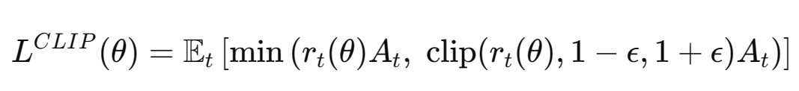
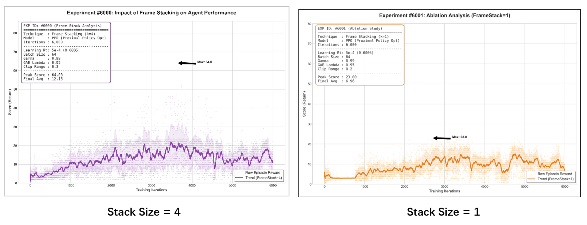
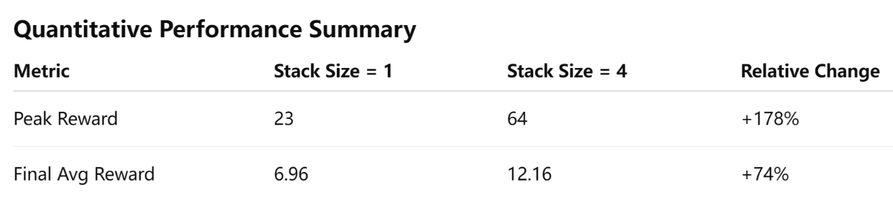

## Project Status Report

**Due date:** Monday, February 23, 2026

## Part 1: Clean Up the Website (30 points)

- **Project/Team Name:**
- **Improving the Front Page:**
- **Team page:**

## Part 2: Technical Description (35 points)

- **Project Summary**

### 1. Approach

Inspired by recent reinforcement learning research emphasizing system-level experimental design (Schwarzer et al., 2023), we evaluate PPO not only as a standalone algorithm but as a combination of interacting design components. Prior work suggests that performance gains in modern RL often arise from improving data utilization efficiency and increasing the number of gradient updates per collected sample, rather than introducing entirely new algorithmic structures. Following this principle, our experiments systematically analyze how temporal observation design (FrameStack size), training horizon length, and optimization settings interact to influence learning stability and convergence speed.

The reinforcement learning agent is trained using the Proximal Policy Optimization (PPO) algorithm. PPO updates the policy by maximizing a clipped surrogate objective to stabilize training and improve sample efficiency. The policy objective is defined as:

where \(r_t(\theta) = \frac{\pi_{\theta}(a_t \mid s_t)}{\pi_{\theta_{old}}(a_t \mid s_t)}\) is the probability ratio and \(A_t\) is the advantage estimate computed using Generalized Advantage Estimation (GAE). The total loss combines policy loss, value function loss, and entropy regularization to balance performance and exploration.

Training data is collected by allowing the agent to interact directly with the environment. Each training rollout collects 256 environment steps before performing policy updates. The agent is trained for approximately 7000-10000 environment interaction steps for each experiment run. During each rollout update, the collected data is divided into mini-batches of size 64, and the policy network is optimized for 4 epochs using Stochastic Gradient Descent (SGD). The input to the policy network consists of stacked observation frames (FrameStack), and the output is a stochastic action sampled from the learned policy distribution.

The training process uses a learning rate of \(3 \times 10^{-4}\), a PPO clipping parameter \(\epsilon = 0.2\), and an entropy coefficient of 0.01 to encourage exploration. The clipping is set to \(\epsilon = 0.2\), a commonly used value that constrains policy updates between optimization steps and helps maintain stable learning dynamics during training. Default hyperparameter values follow standard PPO implementations, and final values were selected based on empirical training stability and reward convergence. To ensure reproducibility, all experiments fix random seeds and maintain consistent evaluation protocols across runs.

This methodological design enables a systematic evaluation of how architectural, temporal, and optimization choices jointly influence training stability and overall learning performance in PPO.

### 2. Evaluation

This part presents the evaluation of the implemented reinforcement learning agent. Both quantitative and qualitative analyses are used to demonstrate that the implementation is functional, stable, and capable of learning meaningful policies. In addition, an ablation study is conducted to analyze the contribution of key design components.

#### Evaluation Setup

The agent is evaluated in the MinAtar Space Invaders environment using consistent training and evaluation protocols. Performance is measured using episode reward statistics across training iterations. Each experiment is repeated with fixed random seeds to ensure reproducibility. Training curves, reward trends, and performance summaries are used as primary evaluation metrics.

#### Quantitative Results

**Overall Training Performance**

Training curves show that the PPO agent gradually improves reward performance over time. The learning process demonstrates stable convergence behavior without severe oscillations or collapse, indicating that the selected hyperparameters and training configuration are suitable for this environment. Peak reward and final average reward values confirm that the agent successfully learns a meaningful control policy.

**Ablation Study: Effect of Frame Stacking**

To evaluate the importance of temporal observation information, we compare performance between Frame Stack = 4 and Frame Stack = 1 under identical training settings.

Results show that Frame Stack = 4 achieves significantly higher peak reward, faster learning speed, and more stable reward trends (as shown by the purple trend line below). In contrast, Frame Stack = 1 demonstrates slower convergence, lower peak performance, and higher variance during training (as shown by the orange trend line below).

These results suggest that temporal information plays an important role in stabilizing policy learning and improving performance in dynamic environments.

#### Qualitative Results

Qualitative evaluation is conducted by observing agent gameplay behavior under the trained policy. The agent demonstrates more consistent shooting, improved enemy avoidance, and better action timing compared to early training stages. These observations suggest that the agent learns meaningful gameplay strategies beyond simply improving numerical reward metrics.

#### Discussion

Overall, the evaluation results demonstrate that the PPO implementation is stable, reproducible, and effective in learning policies for the target environment. Quantitative results confirm reward improvement and training stability, while qualitative observations verify that learned behaviors are meaningful and task-relevant. The ablation study further highlights the importance of temporal observation stacking in improving agent performance.

### 3. Remaining Goals and Challenges

#### Remaining Goals

Our PPO-based agent demonstrates stable policy learning across observation settings; therefore, our remaining goal is not algorithm redesign, but strengthening experimental validation through system-level optimization of existing training components, with a focus on how data utilization efficiency and update frequency affect training stability and performance.

First, we plan to extend evaluation beyond the current frame stacking ablation. Although our results already show that temporal information improves performance, we plan to run additional controlled tests, such as adjusting learning rates and testing different stack sizes if time allows. The goal is not large-scale hyperparameter search, but to verify that our current settings operate within stable and efficient training regions.

Second, we want to improve training consistency. Most of our conclusions currently rely on single-run results. If computational resources allow, we will run multiple random seeds and compare average performance trends. Even a small number of repeated runs can help verify that improvements are not caused by randomness and can strengthen the reliability of our conclusions.

Third, if time permits, we plan to compare our method with at least one additional baseline already implemented by our team, such as DQN. This will be a lightweight comparison intended to provide context for PPO performance in our environment, rather than a full multi-algorithm benchmark study.

#### Expected Challenges

One practical challenge is computational cost. RL training is time-consuming, and running multiple seeds or longer training schedules may exceed our current compute resources. To address this, we may slightly shorten training length or focus more on comparing learning trends rather than only final performance metrics.

Another potential issue is training instability. Although PPO is generally stable, performance can still fluctuate due to reward variance and exploration randomness. If strong instability appears, we will apply small adjustments to learning rate or clipping range instead of aggressive hyperparameter tuning, keeping experiments controlled and interpretable.

Finally, time management is a realistic constraint. Since this is a course project, our priority is to produce reliable evaluation and clear analysis rather than adding more complex model components. If necessary, we will prioritize experimental clarity, reproducibility, and systematic evaluation over expanding algorithm complexity.

### 4. Resources Used

- Schwarzer, M., Obando-Ceron, J., Courville, A., Bellemare, M., Agarwal, R., & Castro, P. S. (2023). *Bigger, Better, Faster: Human-level Atari with human-level efficiency*. arXiv. https://doi.org/10.48550/arXiv.2305.19452
- YouTube Channel Name. Video Title. YouTube, Year. https://www.youtube.com/watch?v=HlKHCg6rz0s
- [MinAtar Space Invaders - Pgx Documentation](https://www.sotets.uk/pgx/minatar_space_invaders/)
- Young, K., & Tian, T. (2019). *MinAtar: An Atari-Inspired Testbed for Thorough and Reproducible Reinforcement Learning Experiments*. arXiv preprint arXiv:1903.03176.

## Part 3: Video Summary (35 points)

Create a 2-5 (ideally ~3) minute video summarizing your progress so far.
