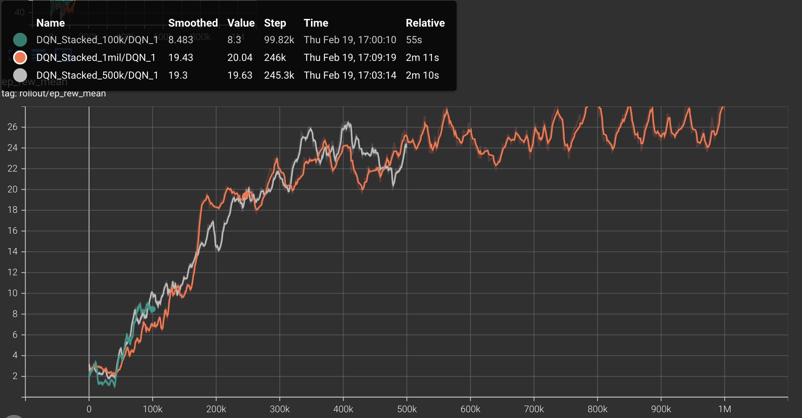
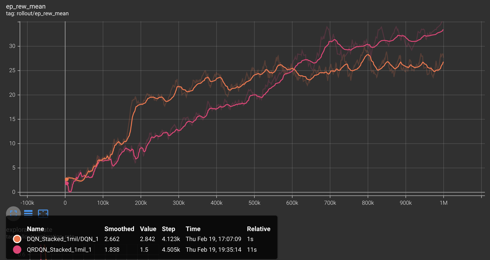
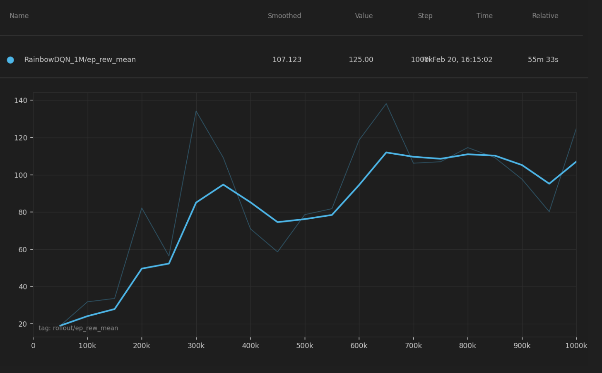

## Summary

Space Invaders is a classic fixed-shooter game where the player controls a starfighter, attacking and dodging enemies from above. Rather than treating this as a one-off application, our project uses Space Invaders as a controlled testbed for comparing and understanding advanced reinforcement learning methods.

To make broad comparisons feasible and fully focus on algorithm performance, we will use the MinAtar SpaceInvaders through Gymnasium. MinAtar provides a simplified 10×10 channel-based observation space that trains much faster than full Atari environments, enabling us to run multiple seeds, hyperparameter sweeps, and component ablations within our compute budget. We plan to evaluate and compare the performance of Deep Q-Network(DQN), Quantile Regression Deep Q-Learning(QRDQN), Rainbow Deep Q-Learning, and Proximal Policy Optimization(PPO).

## Approach

### DQN

Deep Q-Network(DQN) is a model-free, value-based reinforcement learning algorithm. DQN is a popular method for training video games, especially atari games, and performs well when there are a large number of states.  DQN is based on Q-Learning, which is a model free algorithm that iteratively tests states and actions using rewards from a table of ‘Q-Values’.  Q-Learning struggles with large numbers of states and continuous actions, so Deep Q-Learning replaces this table in Q-Learning with a neural network that approximates Q-Values. The input to this network is the state, it outputs Q-values for all possible actions.

Loss function: $$\mathcal{L}_\theta = (r + \gamma \max_{a'} Q_{\bar{\theta}}(s', a') - Q_\theta(s, a))^2$$

Using the MinAtar environment, we trained the Stable-Baselines3 DQN model at first without adjusting any hyperparameters on runs of 100,000, 500,000, and 1,000,000 timesteps.    In the MinAtar environment, the agent receives a reward of +1 for every opponent destroyed, and there are no negative rewards.  The model uses a discrete action space with 6 possible outputs corresponding to moving and shooting.  The minAtar environment suffers from partial observability, where the model cannot interpret the direction of a moving object since it is shown in a static frame.  To combat this problem, we used temporal frame stacking, where groups of four frames are stacked together to give more context about the direction of the moving object. Frame stacking provided improved performance of the model, as it could determine whether bullets were moving at it or away from it. 

### QRDQN

Our proposal stated we were going to explore Double DQN, but we instead chose to explore Quantile Regression Deep Q-Network(QRDQN), as QRDQN was available on Stable-Baselines3-contrib, which keeps consistency with our baseline DQN model used.  QRDQN is a distributional reinforcement learning algorithm. that builds on top of DQN by using quantile regression to parametrize the return distribution, rather than estimating a single scalar mean.  QR-DQN modifies the output layer of a standard DQN to produce N quantile values per action, which helps account for uncertainty in the environment. Since it tracks the full distribution, The distributional approach helps avoid the overestimation problem that is a known weakness of DQN.

Loss function: Quantile Huber Loss for a specific quantile &tau;:

$$
\rho_\tau^\kappa(u) = |\tau - \delta_{\{u < 0\}}| \mathcal{L}_\kappa(u)
$$

As mentioned above, we used the QRDQN model from Stable-Baselines3-contrib to keep consistency with the DQN model used. The same reward, action space and time step trials were used along with 4 frame temporal stacking. Again, no hyperparameters were set for the first trials, but will be tested and tuned moving forward.  

### PPO

Inspired by recent reinforcement learning research emphasizing system-level experimental design (Schwarzer et al., 2023), we evaluate PPO not only as a standalone algorithm but as a combination of interacting design components. Prior work suggests that performance gains in modern RL often arise from improving data utilization efficiency and increasing the number of gradient updates per collected sample, rather than introducing entirely new algorithmic structures. Following this principle, our experiments systematically analyze how temporal observation design (FrameStack size), training horizon length, and optimization settings interact to influence learning stability and convergence speed.

The reinforcement learning agent is trained using the Proximal Policy Optimization (PPO) algorithm. PPO updates the policy by maximizing a clipped surrogate objective to stabilize training and improve sample efficiency. The policy objective is defined as:

where rt(&theta;) = &pi;&theta;(at | st) / &pi;&theta;old(at | st) is the probability ratio and At is the advantage estimate computed using Generalized Advantage Estimation (GAE). The total loss combines policy loss, value function loss, and entropy regularization to balance performance and exploration.

Training data is collected by allowing the agent to interact directly with the environment. Each training rollout collects 256 environment steps before performing policy updates. The agent is trained for approximately 7000-10000 environment interaction steps for each experiment run. During each rollout update, the collected data is divided into mini-batches of size 64, and the policy network is optimized for 4 epochs using Stochastic Gradient Descent (SGD). The input to the policy network consists of stacked observation frames (FrameStack), and the output is a stochastic action sampled from the learned policy distribution.

The training process uses a learning rate of 3 x 10-4, a PPO clipping parameter &epsilon; = 0.2, and an entropy coefficient of 0.01 to encourage exploration. The clipping is set to &epsilon; = 0.2, a commonly used value that constrains policy updates between optimization steps and helps maintain stable learning dynamics during training. Default hyperparameter values follow standard PPO implementations, and final values were selected based on empirical training stability and reward convergence. To ensure reproducibility, all experiments fix random seeds and maintain consistent evaluation protocols across runs.

This methodological design enables a systematic evaluation of how architectural, temporal, and optimization choices jointly influence training stability and overall learning performance in PPO.

### Rainbow DQN

Rainbow DQN is a model-free, value-based reinforcement learning algorithm that extends the base DQN by combining six improvements into a single agent: Double DQN, Dueling Networks, Prioritized Experience Replay (PER), Multi-step Returns, Distributional RL (C51), and Noisy Networks. Rainbow is a popular method for training video game agents and performs well in environments with large state spaces. Rather than introducing a fundamentally new algorithm, Rainbow demonstrates that these six components are complementary and jointly produce significantly better performance than any individual enhancement alone.

The core extension over standard DQN is the distributional approach to Q-learning (C51), where instead of estimating a single expected Q-value per action, the network learns a full probability distribution over returns. Noisy Networks replace the standard ε-greedy exploration strategy with learnable parametric noise in the network weights, and the Dueling architecture separates the value and advantage streams to improve Q-value estimation. Double DQN reduces overestimation bias by using the online network to select actions and the target network to evaluate them.

Loss function: $$\mathcal{L}(\theta) = -\frac{1}{B} \sum_{i=1}^{B} w_i \sum_{z} m(z) \log p_{\theta}(z \mid s_i, a_i)$$

We applied Rainbow DQN to the MinAtar Space Invaders environment, training for 5,000,000 frames. The reward structure grants +1 for each enemy destroyed with no penalties, and the agent operates over a discrete action space of 6 moves corresponding to directional movement and shooting. Unlike standard DQN which uses a uniform replay buffer, Rainbow leverages a prioritized replay buffer of size 100,000 that samples transitions proportionally to their loss magnitude, controlled by a priority exponent of α = 0.5, ensuring the agent learns more frequently from surprising or high-error experiences. Rather than bootstrapping from a single next step, 3-step returns are used to propagate reward signals further back through time, improving credit assignment. The importance-sampling exponent β is gradually annealed from 0.4 to 1.0 throughout training to correct for the sampling bias introduced by prioritization. The target network is synchronized with the online network via a hard update every 1,000 gradient steps, and all parameters are optimized using Adam with a learning rate of 1×10⁻⁴.

## Evaluation

### DQN

To evaluate the performance of basic DQN with temporal frame stacking, we conducted a series of test trials across 20 independent games for each model iteration (100k, 500k, and 1M steps). We recorded the maximum, minimum, and mean scores, alongside the average survival time.

Analyzing these metrics we learned that the frame stacking nearly doubled the average reward at the 1 million timestep mark. More importantly, the agent demonstrated a significant increase in survival time, incorporating more defense and dodging, which is a critical in Space Invaders.

The learning curve shown from the DQN with temporal frame stacking for the mean episode reward (ep_rew_mean) shows a rapid increase within the first 200,000 timesteps followed by a more steady refinement of the policy through 1 million steps. This plateau may indicate that the model had finished learning, and could possibly be trained on less timesteps that 1 million, increasing efficiency.

| Version | Steps | Avg Score | Avg Survival | Key Behavior |
| :--- | :--- | :--- | :--- | :--- |
| **Baseline** | 100K | 10.3 | 18.5 frames | Mainly Left, Fire, Right+Fire. |
| **Baseline** | 1M | 14.2 | 110.0 frames | Static firing; reactive movement. |
| **Stacked** | 100K | 6.3 | 43.6 frames | Mix of Left, Right, Fire, Right+Fire. More active dodging. |
| **Stacked** | 1M | **26.5** | **195.0 frames** | Active dodging; predictive movement (inferring bullet paths). |

### QRDQN

When comparing the QRDQN average metrics across 20 games to the DQN with temporal frame stacking, we observe that QRDQN slightly outperforms in average score, but survives in the game for significantly longer.  The learning curve shown in the graph is interesting, as we see the QRDQN learn slower for around the first 500,000 timesteps, but has a sharp increase and shows a higher mean episode reward than DQN for the rest of the timesteps.  We analyzed this as the initial exploration taking longer to estimate the full distribution of returns, but once they are found the performance increases greatly.

| Timesteps | Avg Score | Avg Survival (frames) | Key Behavior |
| :--- | :--- | :--- | :--- |
| **100k** | 8.25 | 53.9 | Left, fire, very heavy on right + fire. Not much dodging. |
| **500k** | 16.60 | 113.5 | Same, but more left and fire than 100k. |
| **1M** | 28.40 | 249.9 | Same, a little more balance. |

### PPO

This part presents the evaluation of the implemented reinforcement learning agent. Both quantitative and qualitative analyses are used to demonstrate that the implementation is functional, stable, and capable of learning meaningful policies. In addition, an ablation study is conducted to analyze the contribution of key design components.

#### Evaluation Setup

The agent is evaluated in the MinAtar Space Invaders environment using consistent training and evaluation protocols. Performance is measured using episode reward statistics across training iterations. Each experiment is repeated with fixed random seeds to ensure reproducibility. Training curves, reward trends, and performance summaries are used as primary evaluation metrics.

#### Quantitative Results

**Overall Training Performance**

Training curves show that the PPO agent gradually improves reward performance over time. The learning process demonstrates stable convergence behavior without severe oscillations or collapse, indicating that the selected hyperparameters and training configuration are suitable for this environment. Peak reward and final average reward values confirm that the agent successfully learns a meaningful control policy.

**Ablation Study: Effect of Frame Stacking**

To evaluate the importance of temporal observation information, we compare performance between Frame Stack = 4 and Frame Stack = 1 under identical training settings.

Results show that Frame Stack = 4 achieves significantly higher peak reward, faster learning speed, and more stable reward trends (as shown by the purple trend line below). In contrast, Frame Stack = 1 demonstrates slower convergence, lower peak performance, and higher variance during training (as shown by the orange trend line below).

These results suggest that temporal information plays an important role in stabilizing policy learning and improving performance in dynamic environments.

#### Qualitative Results

Qualitative evaluation is conducted by observing agent gameplay behavior under the trained policy. The agent demonstrates more consistent shooting, improved enemy avoidance, and better action timing compared to early training stages. These observations suggest that the agent learns meaningful gameplay strategies beyond simply improving numerical reward metrics.

#### Discussion

Overall, the evaluation results demonstrate that the PPO implementation is stable, reproducible, and effective in learning policies for the target environment. Quantitative results confirm reward improvement and training stability, while qualitative observations verify that learned behaviors are meaningful and task-relevant. The ablation study further highlights the importance of temporal observation stacking in improving agent performance.

### Rainbow DQN

#### Evaluation Setup

20 independent test episodes were run at four checkpoints (250k, 500k, 750k, 1M steps). Metrics recorded: max, min, mean score, and average survival time. The agent runs in greedy eval mode with noisy layers disabled; the environment retains sticky actions (10%) and difficulty ramping.

#### Quantitative Results

#### Training Performance

The learning curve shows a sharp rise within the first 300k timesteps, followed by steady improvement through 1M steps. Unlike the DQN variants which plateau around 500k, Rainbow DQN continues improving throughout, suggesting the policy had not yet saturated at 1M steps.

#### Performance Summary

| Version | Steps | Avg Score | Max Score | Min Score | Avg Survival | Key Behavior |
|---------|-------|-----------|-----------|-----------|--------------|--------------|
| Rainbow | 250k  | 74.8      | 167.0     | 7.0       | 635.9 frames | Right+Fire 58%, Left 21%, Fire 18% |
| Rainbow | 500k  | 79.6      | 166.0     | 18.0      | 596.6 frames | Right+Fire 56%, Left 20%, Fire 18% |
| Rainbow | 750k  | 94.0      | 236.0     | 7.0       | 693.0 frames | Right+Fire 48%, Left 21%, Fire 19% |
| Rainbow | 1M    | 106.0     | 237.0     | 22.0      | 817.8 frames | Right+Fire 42%, Left 19%, Fire 17% |

Average reward grows 42% from 250k to 1M. Survival time follows the same trend, reaching 817.8 frames at 1M, confirming the agent is surviving longer rather than just scoring faster.

#### Comparison to DQN Baselines

| Version      | Steps | Avg Score | Avg Survival  |
|--------------|-------|-----------|---------------|
| Baseline DQN | 1M    | 14.2      | 110.0 frames  |
| Stacked DQN  | 1M    | 26.5      | 195.0 frames  |
| Rainbow DQN  | 250k  | 74.8      | 635.9 frames  |
| Rainbow DQN  | 1M    | 106.0     | 817.8 frames  |

Rainbow at 1M is **7.5× higher score** and **7.4× longer survival** than Baseline DQN, and **4× better** than Stacked DQN on both metrics. Most notably, Rainbow at just **250k steps already outperforms Stacked DQN at 1M**, demonstrating significantly greater sample efficiency.

#### Qualitative Results

At 250k steps the agent shows a strong positional bias, firing predominantly from the right side (Right+Fire 58%). By 1M steps this drops to 42%, with the agent repositioning more dynamically between shots and adjusting laterally relative to incoming bullets — a shift from reactive, fixed-position firing toward active spatial control.

#### Discussion

The six Rainbow components compound to produce substantial gains over both DQN baselines. Distributional RL and prioritized replay appear most impactful, enabling faster early learning and continued improvement beyond the 1M step mark. Noisy networks avoid the premature convergence seen in epsilon-greedy DQN, explaining why Rainbow's curve does not plateau. High score variance (~50–68 std) is attributable to the stochastic environment rather than policy instability.

## Remaining Goals and Challenges

#### Remaining Goals

### DQN

We have experimented with tuning hyperparameters away from the Atari defaults, which were not included in the current data report, but have shown much improved results in the 100K timestep runs when focused on accelerating the gradient update. We will continue tweaking hyperparameters, trying to achieve higher scores in lower amounts of training time and timesteps.  With the knowledge that Space Invaders can achieve higher results with DQN, we plan to explore the effects of different hyperparameters, and possible the tradeoff of compute and model performance.  Additionally, tables and graphs will be updated with the results from the best hyperparameter combination we have found.

### QRDQN

This version of QRDQN did not tune any hyperparameters. We expect as with standard DQN, once we tune the hyperparameters we will see a significant increase in the agent’s performance, and require less time steps to perform well in Space Invaders.  We also aim to analyze the architecture more in depth, and understand more deeply what aspects of it contribute to the performance.

### PPO

Our PPO-based agent demonstrates stable policy learning across observation settings; therefore, our remaining goal is not algorithm redesign, but strengthening experimental validation through system-level optimization of existing training components, with a focus on how data utilization efficiency and update frequency affect training stability and performance.

First, we plan to extend evaluation beyond the current frame stacking ablation. Although our results already show that temporal information improves performance, we plan to run additional controlled tests, such as adjusting learning rates and testing different stack sizes if time allows. The goal is not large-scale hyperparameter search, but to verify that our current settings operate within stable and efficient training regions.

Second, we want to improve training consistency. Most of our conclusions currently rely on single-run results. If computational resources allow, we will run multiple random seeds and compare average performance trends. Even a small number of repeated runs can help verify that improvements are not caused by randomness and can strengthen the reliability of our conclusions.

Third, if time permits, we plan to compare our method with at least one additional baseline already implemented by our team, such as DQN. This will be a lightweight comparison intended to provide context for PPO performance in our environment, rather than a full multi-algorithm benchmark study.

#### Expected Challenges

One practical challenge is computational cost. RL training is time-consuming, and running multiple seeds or longer training schedules may exceed our current compute resources. To address this, we may slightly shorten training length or focus more on comparing learning trends rather than only final performance metrics.

Another potential issue is training instability. Although PPO is generally stable, performance can still fluctuate due to reward variance and exploration randomness. If strong instability appears, we will apply small adjustments to learning rate or clipping range instead of aggressive hyperparameter tuning, keeping experiments controlled and interpretable.

Finally, time management is a realistic constraint. Since this is a course project, our priority is to produce reliable evaluation and clear analysis rather than adding more complex model components. If necessary, we will prioritize experimental clarity, reproducibility, and systematic evaluation over expanding algorithm complexity.

### Rainbow DQN

Our Rainbow DQN agent already demonstrates strong performance relative to the DQN baselines, so our remaining focus is on validation and efficiency rather than algorithmic redesign. We plan to explore targeted hyperparameter tuning away from the standard Atari defaults. Parameters such as the PER priority exponent, n-step return horizon, and replay buffer size were designed for full Atari and may not be optimal for MinAtar's shorter episode structure. The goal is to achieve comparable or better performance in fewer timesteps, improving training efficiency without sacrificing results. We also aim to strengthen experimental reliability. Current conclusions are based on single training runs. If time and compute allow, we will repeat key runs with different random seeds to verify that observed improvements are consistent rather than the result of a lucky initialization. Last but not least, we will try to analyze a lightweight comparison against the DQN and PPO baselines already implemented by the team, providing broader context for where Rainbow DQN sits relative to all three algorithms in this environment.

**Expected Challenges**

The primary constraint is computational cost. Rainbow DQN is significantly more expensive per step than standard DQN due to distributional loss computation and prioritized sampling, which limits how many hyperparameter configurations or training seeds we can realistically evaluate. We will prioritize the configurations most likely to improve sample efficiency and focus on learning trends rather than exhaustive final performance comparisons. Training variance is also a practical concern. The MinAtar environment's sticky actions and difficulty ramping introduce high episode-to-episode variance, making it difficult to draw strong conclusions from small evaluation sets. Where possible, we will increase the number of test episodes per checkpoint to produce more reliable estimates.

## Resources Used

- Schwarzer, M., Obando-Ceron, J., Courville, A., Bellemare, M., Agarwal, R., & Castro, P. S. (2023). *Bigger, Better, Faster: Human-level Atari with human-level efficiency*. arXiv. https://doi.org/10.48550/arXiv.2305.19452
- YouTube Channel Name. Video Title. YouTube, Year. https://www.youtube.com/watch?v=HlKHCg6rz0s
- [MinAtar Space Invaders - Pgx Documentation](https://www.sotets.uk/pgx/minatar_space_invaders/)
- Young, K., & Tian, T. (2019). *MinAtar: An Atari-Inspired Testbed for Thorough and Reproducible Reinforcement Learning Experiments*. arXiv preprint arXiv:1903.03176.
- MinAtar arxiv paper - https://arxiv.org/pdf/1903.03176
- Stable-Baselines3 DQN documentation - https://stable-baselines3.readthedocs.io/en/master/modules/dqn.html#
- QRDQN arxiv - https://arxiv.org/pdf/1710.10044
- QRDQN explained - https://www.emergentmind.com/topics/quantile-regression-deep-q-network-qr-dqn
- QRDQN Stable-Baselines3-contrib - https://sb3-contrib.readthedocs.io/en/master/modules/qrdqn.html

AI coding assistance was used for model setup, data report printing format, and debugging.

## Part 3: Video Summary (35 points)

<video controls width="100%">
  <source src="assets/status/RLSpaceInvaders%20Progress%20Report.mp4" type="video/mp4">
  Your browser does not support the video tag.
</video>
